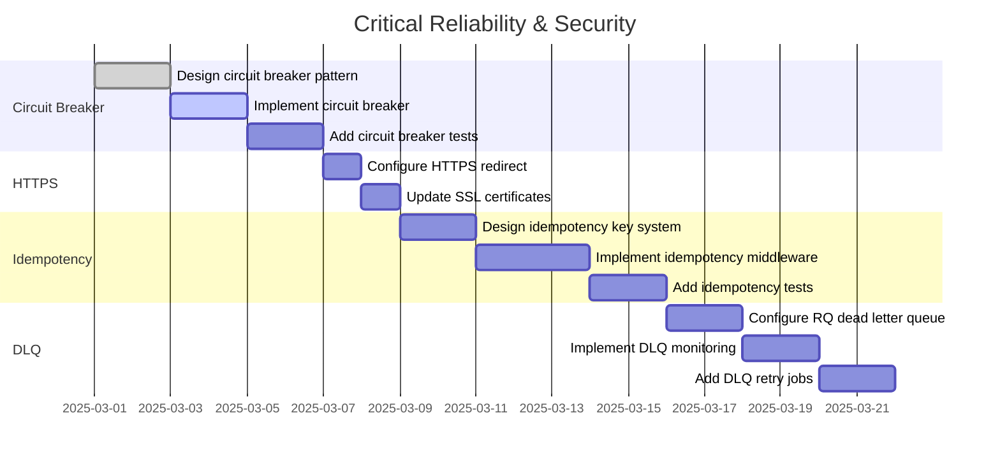

# Production Readiness Assessment Report
## IIT ML Service - Comprehensive Best Practices Analysis

**Assessment Date:** 2025-02-28  
**Scope:** Full-stack application (FastAPI backend + React frontend)  
**Methodology:** Systematic code analysis across 10 production readiness categories

---

## Executive Summary

| Category | Status | Score | Critical Gaps |
|----------|--------|-------|---------------|
| Data Layer | ✅ Strong | 85% | Pub/sub, connection pool monitoring |
| Reliability | ⚠️ Moderate | 60% | Circuit breaker, idempotency, DLQ |
| Scale | ✅ Strong | 80% | Load balancing, horizontal scaling config |
| Security & Auth | ✅ Strong | 85% | HTTPS enforcement, secrets rotation |
| Observability | ⚠️ Moderate | 65% | Distributed tracing, alerting integrations |
| Deployment & Ops | ✅ Strong | 85% | Blue-green deployments, rollback automation |
| Code Quality | ✅ Strong | 90% | Dependency injection, API versioning |
| Networking | ⚠️ Moderate | 55% | CDN, webhooks, API gateway |
| AI Infrastructure | ❌ Weak | 30% | RAG, vector DB, AI observability |
| Cost & Operations | ⚠️ Moderate | 50% | Multi-tenancy, cost tracking, runbooks |

**Overall Production Readiness: 68% (Moderate)**

---

## 1. DATA LAYER (85% - Strong)

### ✅ Implemented Practices

| Practice | Status | Evidence |
|----------|--------|----------|
| **Database Indexes** | ✅ Excellent | 35+ indexes on all major tables (patients, visits, observations, predictions, alerts, interventions) |
| **Transactions** | ✅ Implemented | `db.commit()` / `db.rollback()` patterns throughout [`crud.py`](backend/ml-service/app/crud.py), [`api/patients.py`](backend/ml-service/app/api/patients.py) |
| **Schema Migrations** | ✅ Implemented | Alembic with 2+ migrations in [`alembic/versions/`](alembic/versions/) |
| **Soft Deletes** | ✅ Implemented | `voided` column on Visit, Observation, Encounter models in [`models.py`](backend/ml-service/app/models.py:86) |
| **Queue System** | ✅ Implemented | RQ (Redis Queue) with workers in [`queue/jobs.py`](backend/ml-service/app/queue/jobs.py), [`run_worker.py`](backend/ml-service/run_worker.py) |
| **Caching Strategy** | ✅ Implemented | Redis caching in [`middleware/caching.py`](backend/ml-service/app/middleware/caching.py) with TTL and invalidation |
| **Connection Pooling** | ✅ Implemented | SQLAlchemy engine with pool config in [`utils/database.py`](backend/ml-service/app/utils/database.py) |
| **Normalization** | ✅ Good | Proper 3NF design with separate tables for patients, visits, observations, encounters |

### ❌ Missing Practices

| Practice | Priority | Effort | Recommendation |
|----------|----------|--------|----------------|
| **Pub/Sub System** | Medium | High | Implement Redis pub/sub for real-time events (patient updates, prediction results) |
| **Connection Pool Monitoring** | Medium | Low | Add metrics for pool usage, overflow, wait times |
| **Read Replicas** | Low | High | Consider read replicas for analytics queries |

### Key Files
- [`backend/ml-service/app/models.py`](backend/ml-service/app/models.py) - Database models with indexes
- [`backend/ml-service/app/crud.py`](backend/ml-service/app/crud.py) - CRUD operations with transactions
- [`backend/ml-service/app/middleware/caching.py`](backend/ml-service/app/middleware/caching.py) - Redis caching layer

---

## 2. RELIABILITY (60% - Moderate)

### ✅ Implemented Practices

| Practice | Status | Evidence |
|----------|--------|----------|
| **Retry with Exponential Backoff** | ✅ Excellent | Tenacity decorators in [`utils/retry.py`](backend/ml-service/app/utils/retry.py:47-198) |
| **Timeouts** | ✅ Implemented | Queue jobs, DB operations, API calls have timeout configurations |
| **Graceful Degradation** | ✅ Partial | Error handling middleware in [`middleware/error_handling.py`](backend/ml-service/app/middleware/error_handling.py) |

### ❌ Missing Practices

| Practice | Priority | Effort | Recommendation |
|----------|----------|--------|----------------|
| **Circuit Breaker** | **Critical** | Medium | Implement circuit breaker pattern for external dependencies (using pybreaker or resilience) |
| **Idempotency Keys** | **High** | Medium | Add idempotency keys to POST/PUT endpoints for safe retries |
| **Dead Letter Queues** | **High** | Medium | Configure DLQ for failed RQ jobs with retry policies |
| **Health Check Dependencies** | High | Low | Add dependency checks (Redis, DB) to health endpoint |
| **Bulkhead Pattern** | Medium | High | Implement bulkheads for isolating failure domains |

### Implementation Priority
1. **Circuit Breaker** - Prevent cascading failures
2. **Idempotency** - Enable safe client retries
3. **Dead Letter Queues** - Handle failed jobs gracefully

---

## 3. SCALE (80% - Strong)

### ✅ Implemented Practices

| Practice | Status | Evidence |
|----------|--------|----------|
| **Rate Limiting** | ✅ Excellent | Per-IP and per-user rate limiting in [`middleware/security.py`](backend/ml-service/app/middleware/security.py:117-157) |
| **Stateless Design** | ✅ Implemented | JWT tokens, no session state in application |
| **Async Heavy Work** | ✅ Implemented | RQ workers for ETL, batch predictions, reports in [`queue/jobs.py`](backend/ml-service/app/queue/jobs.py) |
| **Connection Pooling** | ✅ Implemented | SQLAlchemy pool with size limits |
| **Pagination** | ✅ Excellent | Comprehensive pagination (page, page_size, offset, limit) across all list endpoints |

### ❌ Missing Practices

| Practice | Priority | Effort | Recommendation |
|----------|----------|--------|----------------|
| **Load Balancer Configuration** | High | Medium | Add nginx/HAProxy config for horizontal scaling |
| **Horizontal Scaling Docs** | High | Low | Document scaling procedures and statelessness requirements |
| **Auto-scaling Policies** | Medium | High | Configure K8s HPA or AWS Auto Scaling based on CPU/memory |
| **Database Sharding** | Low | Very High | Consider for multi-region deployment |

### Key Files
- [`backend/ml-service/app/middleware/security.py`](backend/ml-service/app/middleware/security.py) - Rate limiting implementation
- [`backend/ml-service/app/api/patients.py`](backend/ml-service/app/api/patients.py:46-107) - Pagination example

---

## 4. SECURITY & AUTH (85% - Strong)

### ✅ Implemented Practices

| Practice | Status | Evidence |
|----------|--------|----------|
| **Authentication** | ✅ Excellent | Bcrypt password hashing, JWT access/refresh tokens in [`auth.py`](backend/ml-service/app/auth.py:35-58) |
| **Authorization** | ✅ Implemented | RBAC with roles, permissions in [`models.py`](backend/ml-service/app/models.py:492-548) |
| **Input Validation** | ✅ Excellent | Pydantic models with Field validators in [`schema.py`](backend/ml-service/app/schema.py) |
| **Secrets in Environment** | ✅ Implemented | Settings via environment variables in [`config.py`](backend/ml-service/app/config.py) |
| **XSS Protection** | ✅ Implemented | Input sanitization in [`middleware/validation.py`](backend/ml-service/app/middleware/validation.py) |
| **SQL Injection Protection** | ✅ Implemented | SQLAlchemy ORM with parameterized queries |
| **Security Headers** | ✅ Implemented | Security headers middleware in [`main.py`](backend/ml-service/app/main.py:55-66) |

### ⚠️ Partial Implementation

| Practice | Status | Gap |
|----------|--------|-----|
| **HTTPS Enforcement** | ⚠️ Partial | No redirect from HTTP to HTTPS in production config |
| **Secrets Rotation** | ⚠️ Partial | No automated rotation for JWT secrets, API keys |

### ❌ Missing Practices

| Practice | Priority | Effort | Recommendation |
|----------|----------|--------|----------------|
| **HTTPS Redirect** | **Critical** | Low | Add HTTP to HTTPS redirect in nginx/proxy |
| **Secrets Rotation** | **High** | Medium | Implement rotation for JWT secrets, DB credentials |
| **API Key Rotation** | High | Medium | Add API key rotation for external integrations |
| **Data Privacy Compliance** | Medium | High | Add GDPR/PII handling documentation and consent tracking |

### Key Files
- [`backend/ml-service/app/auth.py`](backend/ml-service/app/auth.py) - Authentication implementation
- [`backend/ml-service/app/schema.py`](backend/ml-service/app/schema.py) - Input validation schemas
- [`backend/ml-service/app/middleware/security.py`](backend/ml-service/app/middleware/security.py) - Security middleware

---

## 5. OBSERVABILITY (65% - Moderate)

### ✅ Implemented Practices

| Practice | Status | Evidence |
|----------|--------|----------|
| **Structured Logging** | ✅ Excellent | Contextual logging with user_id, request_id throughout codebase |
| **Metrics** | ✅ Implemented | Prometheus metrics (Counter, Histogram, Gauge) in [`monitoring.py`](backend/ml-service/app/monitoring.py) |
| **Error Tracking** | ✅ Implemented | Sentry integration in [`src/lib/sentry.ts`](src/lib/sentry.ts) |
| **Health Checks** | ✅ Implemented | Health endpoint with DB/Redis checks in [`health.py`](backend/ml-service/app/health.py) |

### ❌ Missing Practices

| Practice | Priority | Effort | Recommendation |
|----------|----------|--------|----------------|
| **Distributed Tracing** | **High** | High | Implement OpenTelemetry with Jaeger/Zipkin export |
| **Alerting Integrations** | **High** | Medium | Add PagerDuty, OpsGenie, or Slack webhook integrations |
| **Metrics Dashboards** | High | Low | Create Grafana dashboards for key metrics |
| **Log Aggregation** | Medium | Medium | Configure ELK/Loki for centralized logging |
| **Custom Business Metrics** | Medium | Low | Add business metrics (prediction accuracy, patient outcomes) |

### Key Files
- [`backend/ml-service/app/monitoring.py`](backend/ml-service/app/monitoring.py) - Prometheus metrics
- [`src/lib/sentry.ts`](src/lib/sentry.ts) - Error tracking
- [`backend/ml-service/monitoring/`](backend/ml-service/monitoring/) - Grafana configs

---

## 6. DEPLOYMENT & OPERATIONS (85% - Strong)

### ✅ Implemented Practices

| Practice | Status | Evidence |
|----------|--------|----------|
| **Feature Flags** | ✅ Excellent | Database-backed feature flags with percentage rollout in [`features/service.py`](backend/ml-service/app/features/service.py) |
| **CI/CD** | ✅ Implemented | GitHub Actions workflows in [`.github/workflows/`](.github/workflows/) |
| **Safe Deploys** | ✅ Implemented | Docker multi-stage builds in [`Dockerfile`](Dockerfile) |
| **Environment Parity** | ✅ Good | Docker Compose for dev/prod parity in [`docker-compose.yml`](docker-compose.yml) |
| **12-Factor Compliance** | ✅ Good | Config via env vars, stateless processes, discrete backing services |

### ⚠️ Partial Implementation

| Practice | Status | Gap |
|----------|--------|-----|
| **Blue-Green Deployments** | ⚠️ Partial | No automated blue-green switchback |
| **Rollback Automation** | ⚠️ Partial | Manual rollback process documented |

### ❌ Missing Practices

| Practice | Priority | Effort | Recommendation |
|----------|----------|--------|----------------|
| **Automated Rollback** | **High** | Medium | Add automated rollback on health check failure |
| **Canary Deployments** | Medium | High | Implement canary analysis with traffic shifting |
| **Smoke Tests** | Medium | Low | Add post-deployment smoke test suite |

### Key Files
- [`backend/ml-service/app/features/service.py`](backend/ml-service/app/features/service.py) - Feature flag service
- [`.github/workflows/ci-cd.yml`](.github/workflows/ci-cd.yml) - CI/CD pipeline
- [`docker-compose.prod.yml`](docker-compose.prod.yml) - Production deployment config

---

## 7. CODE QUALITY & ARCHITECTURE (90% - Strong)

### ✅ Implemented Practices

| Practice | Status | Evidence |
|----------|--------|----------|
| **Separation of Concerns** | ✅ Excellent | Clear module boundaries (api, models, crud, middleware, services) |
| **DRY Principle** | ✅ Good | Shared utilities in [`utils/`](backend/ml-service/app/utils/) |
| **YAGNI Principle** | ✅ Good | Minimal unnecessary complexity |
| **Automated Tests** | ✅ Excellent | Comprehensive test suite (unit, integration, E2E) in [`tests/`](backend/ml-service/tests/) |
| **Version Control** | ✅ Implemented | Git with structured commits |
| **API Versioning** | ✅ Implemented | `/v1/` prefix for all API endpoints |

### ❌ Missing Practices

| Practice | Priority | Effort | Recommendation |
|----------|----------|--------|----------------|
| **Dependency Injection** | Medium | Medium | Refactor to use dependency injection container (e.g., dependency-injector) |
| **API Deprecation Policy** | Low | Low | Document API deprecation timeline and version support |

### Key Files
- [`backend/ml-service/tests/`](backend/ml-service/tests/) - Comprehensive test suite
- [`backend/ml-service/app/api/`](backend/ml-service/app/api/) - API endpoint modules

---

## 8. NETWORKING & INFRASTRUCTURE (55% - Moderate)

### ✅ Implemented Practices

| Practice | Status | Evidence |
|----------|--------|----------|
| **API Design** | ✅ Excellent | RESTful design with proper HTTP methods, status codes |
| **API Versioning** | ✅ Implemented | `/v1/` prefix throughout API |
| **Pagination** | ✅ Excellent | Consistent pagination across all list endpoints |
| **DNS/HTTP Fundamentals** | ✅ Good | Proper use of HTTP verbs, caching headers |

### ❌ Missing Practices

| Practice | Priority | Effort | Recommendation |
|----------|----------|--------|----------------|
| **CDN** | **High** | Medium | Implement CDN for static assets and API responses |
| **Webhooks** | Medium | High | Add webhook system for external integrations |
| **API Gateway** | Medium | Medium | Consider API Gateway (Kong, AWS API Gateway) for rate limiting, auth |
| **Serverless/Edge** | Low | Very High | Evaluate edge computing for global latency reduction |

### Key Files
- [`backend/ml-service/app/api/patients.py`](backend/ml-service/app/api/patients.py) - API design example

---

## 9. AI INFRASTRUCTURE (30% - Weak)

### ✅ Implemented Practices

| Practice | Status | Evidence |
|----------|--------|----------|
| **Model Versioning** | ✅ Implemented | Model registry in [`model_registry.py`](backend/ml-service/app/model_registry.py) |
| **Model Monitoring** | ✅ Implemented | Metrics tracking in [`monitoring.py`](backend/ml-service/app/monitoring.py) |
| **Ensemble Methods** | ✅ Implemented | Ensemble predictions in [`ensemble_methods.py`](backend/ml-service/app/ensemble_methods.py) |
| **Explainability** | ✅ Implemented | SHAP-based explanations in [`explainability.py`](backend/ml-service/app/explainability.py) |

### ❌ Missing Practices

| Practice | Priority | Effort | Recommendation |
|----------|----------|--------|----------------|
| **Vector Database** | **High** | High | Implement vector DB (Pinecone, Weaviate) for semantic search |
| **RAG Implementation** | **High** | High | Add Retrieval Augmented Generation for clinical decision support |
| **AI Observability** | **High** | Medium | Implement ML-specific observability (drift detection, bias monitoring) |
| **Model Artifacts Store** | Medium | Medium | Use MLflow or similar for model artifact versioning |
| **Feature Store** | Medium | High | Implement feature store for offline/online feature consistency |

### Key Files
- [`backend/ml-service/app/model_registry.py`](backend/ml-service/app/model_registry.py) - Model versioning
- [`backend/ml-service/app/explainability.py`](backend/ml-service/app/explainability.py) - Model explainability

---

## 10. COST & OPERATIONS (50% - Moderate)

### ✅ Implemented Practices

| Practice | Status | Evidence |
|----------|--------|----------|
| **Documentation** | ✅ Good | OpenAPI/Swagger docs at `/docs`, code comments |
| **Backup System** | ✅ Implemented | Backup/restore in [`api/backup.py`](backend/ml-service/app/api/backup.py) |
| **Alert Acknowledgment** | ✅ Implemented | Alert acknowledgment workflow in [`models.py`](backend/ml-service/app/models.py:623-638) |

### ❌ Missing Practices

| Practice | Priority | Effort | Recommendation |
|----------|----------|--------|----------------|
| **Multi-Tenancy** | **High** | Very High | Implement tenant isolation (data, RBAC, billing) |
| **Cost Tracking** | **High** | Medium | Add cost monitoring (AWS Cost Explorer, custom metrics) |
| **Incident Response Runbooks** | **High** | Medium | Create runbooks for common incidents |
| **On-Call Procedures** | High | Low | Define on-call rotation and escalation policies |
| **SLA/SLO Definitions** | High | Low | Document and track SLAs/SLOs |

---

## Prioritized Recommendations

### Critical Priority (Implement Immediately)

| # | Practice | Category | Effort | Impact |
|---|----------|----------|--------|--------|
| 1 | **Circuit Breaker** | Reliability | Medium | Prevents cascading failures |
| 2 | **HTTPS Redirect** | Security | Low | Encrypts all traffic |
| 3 | **Idempotency Keys** | Reliability | Medium | Enables safe retries |
| 4 | **Dead Letter Queues** | Reliability | Medium | Handles failed jobs |
| 5 | **Distributed Tracing** | Observability | High | Debug distributed issues |
| 6 | **Alerting Integrations** | Observability | Medium | Proactive incident response |

### High Priority (Implement Soon)

| # | Practice | Category | Effort | Impact |
|---|----------|----------|--------|--------|
| 7 | **CDN Implementation** | Networking | Medium | Reduces latency |
| 8 | **Secrets Rotation** | Security | Medium | Improves security posture |
| 9 | **Vector Database + RAG** | AI Infrastructure | High | Enables advanced AI features |
| 10 | **Multi-Tenancy** | Cost & Operations | Very High | Enables SaaS model |
| 11 | **Cost Tracking** | Cost & Operations | Medium | Optimizes cloud spend |
| 12 | **Incident Response Runbooks** | Cost & Operations | Medium | Improves MTTR |

### Medium Priority (Consider for Next Quarter)

| # | Practice | Category | Effort | Impact |
|---|----------|----------|--------|--------|
| 13 | **Automated Rollback** | Deployment | Medium | Faster recovery |
| 14 | **Canary Deployments** | Deployment | High | Safer releases |
| 15 | **Webhooks System** | Networking | High | External integrations |
| 16 | **AI Observability** | AI Infrastructure | Medium | Better model monitoring |
| 17 | **API Gateway** | Networking | Medium | Centralized API management |

---

## Implementation Roadmap

### Phase 1: Critical Reliability & Security (2-4 weeks)


### Phase 2: Observability Enhancement (3-4 weeks)
```mermaid
gantt
    title Observability Enhancement
    dateFormat YYYY-MM-DD
    section Distributed Tracing
    Set up OpenTelemetry              :3d
    Configure Jaeger exporter         :2d
    Add tracing to API endpoints      :4d
    section Alerting
    Integrate PagerDuty/Slack         :3d
    Create alert rules                :3d
    Test alert escalation             :2d
    section Dashboards
    Create Grafana dashboards         :4d
    Add business metrics              :3d
```

### Phase 3: AI Infrastructure (4-6 weeks)
```mermaid
gantt
    title AI Infrastructure
    dateFormat YYYY-MM-DD
    section Vector Database
    Select vector DB provider         :2d
    Design vector schema              :3d
    Implement embedding pipeline      :5d
    section RAG
    Design RAG architecture           :3d
    Implement retrieval pipeline      :5d
    Integrate with prediction API     :4d
    section AI Observability
    Implement drift detection         :4d
    Add bias monitoring               :3d
    Create model performance dashboards :3d
```

### Phase 4: Multi-Tenancy & Cost (6-8 weeks)
```mermaid
gantt
    title Multi-Tenancy & Cost
    dateFormat YYYY-MM-DD
    section Multi-Tenancy
    Design tenant isolation           :5d
    Implement tenant context          :7d
    Add tenant RBAC                   :5d
    Migrate existing data             :7d
    section Cost Tracking
    Set up cost monitoring            :3d
    Create cost alerts                :2d
    Implement cost optimization       :5d
    section Operations
    Create incident runbooks          :5d
    Define SLAs/SLOs                  :2d
    Set up on-call rotation           :2d
```

---

## Conclusion

The IIT ML Service demonstrates **strong foundational practices** across data layer, security, code quality, and deployment. However, **critical gaps exist** in reliability patterns (circuit breaker, idempotency), observability (distributed tracing, alerting), and AI infrastructure (RAG, vector database).

**Recommended Focus:**
1. **Immediate**: Implement circuit breaker, HTTPS redirect, and idempotency for production safety
2. **Short-term**: Add distributed tracing and alerting integrations for operational excellence
3. **Medium-term**: Build AI infrastructure (RAG, vector DB) for advanced capabilities
4. **Long-term**: Implement multi-tenancy for SaaS scalability

**Estimated Effort to Full Production Readiness: 15-20 weeks** with focused development on high-priority items.

---

## Appendix: Detailed Findings by Category

### A. Database Indexes Found
- Patients: `pepfar_id`, `datim_id`, `state_province`, `phone_number`
- Visits: `patient_uuid`, `date_started`
- Observations: `patient_uuid`, `obs_datetime`, `variable_name`, `concept_id`
- Predictions: `patient_uuid`, `prediction_timestamp`, `risk_level`
- Alerts: `patient_uuid`, `status`, `alert_type`, `severity`, `created_at`
- Interventions: `patient_uuid`, `status`, `intervention_type`
- Communications: `patient_uuid`, `status`, `communication_type`

### B. Rate Limiting Configuration
```python
# From config.py
rate_limit_enabled: bool = True
rate_limit_requests: int = 100  # requests per window
rate_limit_window: int = 60  # seconds
rate_limit_per_user: bool = True  # Per-user rate limiting
```

### C. Feature Flag Capabilities
- Database-backed storage
- In-memory caching
- Percentage rollout
- Whitelist/blacklist support
- Environment-specific configuration

### D. Test Coverage
- Unit tests (auth, ML model, utilities)
- Integration tests (API endpoints, database)
- E2E tests (full user flows)
- Performance tests (load testing, stress testing)
- Security tests (XSS, SQL injection, rate limiting)
